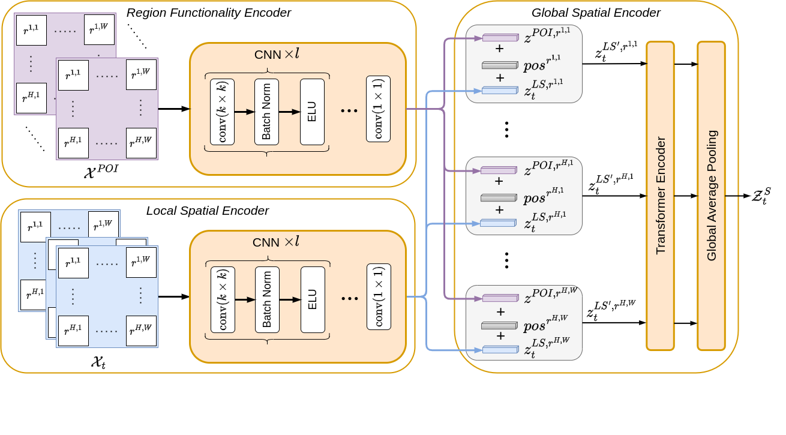

# ST-LoGloNet
# Fusion of Local and Global Spatial Features for Region-Level Spatio-Temporal Prediction

# Description
This repository is the implementation of paper 'Fusion of Local and Global Spatial Features for Region-Level Spatio-Temporal Prediction'. In this work we propose a novel spatio-temporal Network for region-level prediction.

# Folder Structure

`ST-LoGloNet/data/` - module contains the implementation of data loader. 

`ST-LoGloNet/model/` - contains the implementation of ST-LoGloNet architecture.

`ST-LoGloNet/utils/` - module contains the implementation of necessary utilities such as early stopping, evaluation.

To run the code set the configuration of your data in `config.ini` such as `grid_width, grid_height` and run the `main.py`.
Description of each configuration parameter is described in the comments of `config.ini`.